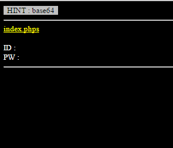
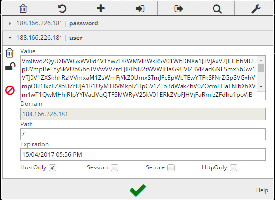
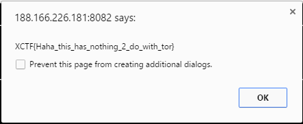

# rot - 3
**Category**: Web

**Problem**:
> Secrets! http://188.166.226.181:8082/

## Solution
When the webpage first opens, it gives you a View Source link, along with ID and PW. However, it seems there are no fields for both of them.



Thankfully, there is a page for source code, so we opened up the page for source code and this is the code:
```php
<html>
    <head>
        <title>Knock Knock Onions!</title>
        <style type="text/css">
            body { background:black; color:white; font-size:10pt; }
        </style>
    </head>
<body>
<?php
    $id_value = $_COOKIE[user];
    $pw_value = $_COOKIE[password];

    $id_value=str_replace("!","1",$id_value);
    $id_value=str_replace("@","2",$id_value);
    $id_value=str_replace("$","3",$id_value);
    $id_value=str_replace("^","4",$id_value);
    $id_value=str_replace("&","5",$id_value);
    $id_value=str_replace("*","6",$id_value);
    $id_value=str_replace("(","7",$id_value);
    $id_value=str_replace(")","8",$id_value);

    $pw_value=str_replace("!","1",$pw_value);
    $pw_value=str_replace("@","2",$pw_value);
    $pw_value=str_replace("$","3",$pw_value);
    $pw_value=str_replace("^","4",$pw_value);
    $pw_value=str_replace("&","5",$pw_value);
    $pw_value=str_replace("*","6",$pw_value);
    $pw_value=str_replace("(","7",$pw_value);
    $pw_value=str_replace(")","8",$pw_value);

    for($i=0;$i<20;$i++){
        $id_value=base64_decode($id_value);
        $pw_value=base64_decode($pw_value);
    }

    echo("<font style=background:silver;color:black>&nbsp;&nbsp;HINT : base64&nbsp;&nbsp;</font><hr><a href=index.phps style=color:yellow;>index.phps</a><br><br>");
    echo("ID : $id_value<br>PW : $pw_value<hr>");

    if($id_value=="admin" && $pw_value=="NUSGreyhats"){
        success();
    }

    function success(){
        echo("<script>alert('no answers in the hints');</script>");
    }
?>
    </body>
</html>
```

From here, we can see that the page checks the user's cookies, which is user and password that has been encoded in Base64 20 times, then it allows the user in if it matches admin and NUSGreyhats for user and password respectively. 

So to get the Base64 encoded value, run this script:
```python
import base64

to_encode = raw_input("Base 64 this 20 times:")

for x in range(20):
	to_encode = base64.b64encode(to_encode)

print to_encode
```

Then I used a chrome extension called EditThisCookie to add 2 new cookies called user and password on the main page:



Then just refresh the page and you will get your flag!



The flag: XCTF{Haha_this_has_nothing_2_do_with_tor}